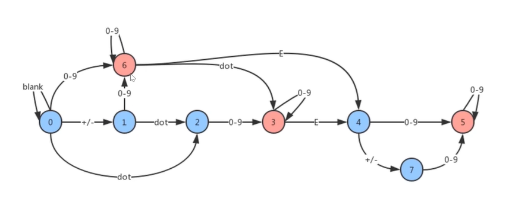
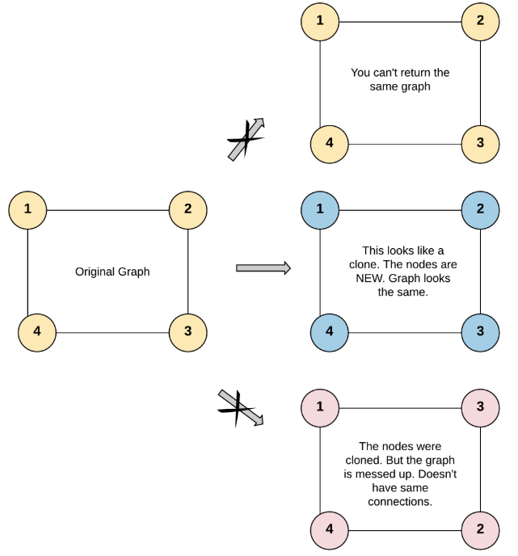
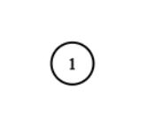

# 链表

## 环形链表 - 141

给定一个链表，判断链表中是否有环。

为了表示给定链表中的环，我们使用整数 pos 来表示链表尾连接到链表中的位置（索引从 0 开始）。 如果 pos 是 -1，则在该链表中没有环。

**示例 1：**

```
输入：head = [3,2,0,-4], pos = 1
输出：true
解释：链表中有一个环，其尾部连接到第二个节点。
```


**示例 2：**

```
输入：head = [1,2], pos = 0
输出：true
解释：链表中有一个环，其尾部连接到第一个节点。
```


**示例 3：**

```
输入：head = [1], pos = -1
输出：false
解释：链表中没有环。
```


进阶：

你能用 O(1)（即，常量）内存解决此问题吗？

***解法***

解法一：快慢指针 空间复杂度O(1)

* 若链表存在环，则快慢指针必定会相遇；快慢指针还可以用来取得链表中间的节点

```js
/**
 * Definition for singly-linked list.
 * function ListNode(val) {
 *     this.val = val;
 *     this.next = null;
 * }
 */

/**
 * @param {ListNode} head
 * @return {boolean}
 */
var hasCycle = function(head) {
    let p1 = head;
    let p2 = head;
    while(p1 && p2 && p2.next) {
      p1 = p1.next;
      p2 = p2.next.next;
      if(p1 == p2) {
        return true;
      }
    }
    return false;
};
```


-----

## 回文链表 - 234

请判断一个链表是否为回文链表。

**示例 1:**

```
输入: 1->2
输出: false
```

**示例2：**

```
输入: 1->2->2->1
输出: true
```

**进阶：**
你能否用 O(n) 时间复杂度和 O(1) 空间复杂度解决此题？

***解法***

* 思路：使用快慢指针找出链表的中间位置断开，翻转后半段链表并遍历比较两链表是否完全相等(奇数偶数链表不影响，因为只要其中一条链表遍历完即表明原链表为回文链表)

```js
/**
 * Definition for singly-linked list.
 * function ListNode(val) {
 *     this.val = val;
 *     this.next = null;
 * }
 */
/**
 * @param {ListNode} head
 * @return {boolean}
 */
var isPalindrome = function(head) {
  if(!head) return true;
  let firstList = head;
  let firstEnd = findHalfEnd(head);
  let secondList = firstEnd.next;
  // 先从中间断开链表，翻转后半段链表
  firstEnd.next = null;
  let secondNewList = reverseList(secondList);
  // 遍历两链表
  let p = secondNewList;
  while(firstList && p) {
    if(firstList.val !== p.val) {
      // 链表不是回文链表，还原链表并返回false
      secondList = reverseList(secondNewList);
      firstEnd.next = secondList;
      return false;
    }
    firstList = firstList.next;
    p = p.next;
  }
  secondList = reverseList(secondNewList);
  firstEnd.next = secondList;
  return true;
};

var findHalfEnd = function(head) {
  let fast = head;
  let slow = head;
  while(fast.next && fast.next.next) {
    slow = slow.next;
    fast = fast.next.next;
  }
  return slow;
}

var reverseList = function(head) {
  let p1 = head;
  let p2 = null;
  while(p1) {
    let tmp = p1.next;
    p1.next = p2;
    p2 = p1;
    p1 = tmp;   
  }
  return p2;
}
```


----

## 移除链表元素 - 203

删除链表中等于给定值 **val** 的所有节点。

**示例:**

```
输入: 1->2->6->3->4->5->6, val = 6
输出: 1->2->3->4->5
```

***解法***

* 使用哨兵节点解决链表第一个节点即为需要删除节点的情况

```js
/**
 * Definition for singly-linked list.
 * function ListNode(val) {
 *     this.val = val;
 *     this.next = null;
 * }
 */
/**
 * @param {ListNode} head
 * @param {number} val
 * @return {ListNode}
 */
var removeElements = function(head, val) {
  // 设置哨兵节点，哨兵节点next指向head
  let p = new ListNode('first');
  p.next = head;
  let cur = head;
  let pre = p;
  while(cur) {
    // 遍历链表
    if(cur.val === val) {
      // cur指针的节点为需要删除的节点，将pre指针的next指向cur指针的next
      pre.next = cur.next;
    } else {
      // 不需要删除的节点，pre指针移动
      pre = cur;
    }
    cur = cur.next;
  }
  return p.next;
};
```


---

## 两数相加 - 2

给出两个 非空 的链表用来表示两个非负的整数。其中，它们各自的位数是按照 逆序 的方式存储的，并且它们的每个节点只能存储 一位 数字。

如果，我们将这两个数相加起来，则会返回一个新的链表来表示它们的和。

您可以假设除了数字 0 之外，这两个数都不会以 0 开头。

**示例：**

```
输入：(2 -> 4 -> 3) + (5 -> 6 -> 4)
输出：7 -> 0 -> 8
原因：342 + 465 = 807
```

***解法***

```js
/**
 * Definition for singly-linked list.
 * function ListNode(val) {
 *     this.val = val;
 *     this.next = null;
 * }
 */
/**
 * @param {ListNode} l1
 * @param {ListNode} l2
 * @return {ListNode}
 */
var addTwoNumbers = function(l1, l2) {
  const l3 = new ListNode(null);
  let p1 = l1;
  let p2 = l2;
  let p3 = l3;
  let flag = 0;
  while(p1 || p2) {
    const res = (p1 ? p1.val : 0) + (p2 ? p2.val : 0) + flag;
    flag = res >= 10 ? 1 : 0;
    p3.next = new ListNode(res % 10);
    p3 = p3.next;
    p1 && (p1 = p1.next);
    p2 && (p2 = p2.next);
  }
  if(flag) p3.next = new ListNode(1);
  return l3.next;
};
```


---

## 两两交换链表中的节点 - 24

给定一个链表，两两交换其中相邻的节点，并返回交换后的链表。

**你不能只是单纯的改变节点内部的值**，而是需要实际的进行节点交换。

 

**示例:**

```
给定 1->2->3->4, 你应该返回 2->1->4->3.
```

***解法***

* 设置哨兵节点记录第一个节点的位置
* head指向每一组对调节点的首端节点
* 设置两个指针(firstNode, secondNode)进行链表交换
* 上一次对调的末端节点(prevNode)连接此次对调后的首端节点
* head移向下一组节点(firstNode.next)

```js
/**
 * Definition for singly-linked list.
 * function ListNode(val) {
 *     this.val = val;
 *     this.next = null;
 * }
 */
/**
 * @param {ListNode} head
 * @return {ListNode}
 */
var swapPairs = function(head) {
  let dummy = new ListNode(-1);
  dummy.next = head;
  let prevNode = dummy;
  while(head && head.next) {
    let firstNode = head;
    let secondNode = head.next;
    // 交换链表节点
    firstNode.next = secondNode.next;
    secondNode.next = firstNode;
    prevNode.next = secondNode;
    // 记录prevNode
    prevNode = firstNode;
    // 移动head指针至下一对节点
    head = firstNode.next;
  }
  return dummy.next;
};
```


---

## 删除链表的倒数第N个节点 - 19

给定一个链表，删除链表的倒数第 *n* 个节点，并且返回链表的头结点。

**示例：**

```
给定一个链表: 1->2->3->4->5, 和 n = 2.

当删除了倒数第二个节点后，链表变为 1->2->3->5.
```

**说明：**

给定的 *n* 保证是有效的。

**进阶：**

你能尝试使用一趟扫描实现吗？

***解法一***

* 使用快慢指针，fast指针与slow指针的间隔为n，当fast指针到达链表末端时，slow指针正好是需要删除的节点的前一个节点
* 在链表前加一个伪指针处理删除表头节点的情况

```js
/**
 * Definition for singly-linked list.
 * function ListNode(val) {
 *     this.val = val;
 *     this.next = null;
 * }
 */
/**
 * @param {ListNode} head
 * @param {number} n
 * @return {ListNode}
 */
var removeNthFromEnd = function(head, n) {
  if(n === 0) return head;
  let dummy = new ListNode(-1);
  dummy.next = head;
  let fast = dummy;
  let slow = dummy;
  while(n+1) {
    // fast指针在slow指针前n+1的位置，使得两指针距离固定为n
    fast = fast.next;
    n--;
  }
  while(fast) {
    //当fast指向链表末端null时，slow正好是需要删除的节点前一个节点
    fast = fast.next;
    slow = slow.next;
  }
  slow.next = slow.next.next;
  return dummy.next;
};
```

***解法二***

* 翻转链表，n即为正序的需要删除的节点的位置，删除后再还原链表


# 集合

## 两个数组的交集 - 349


给定两个数组，编写一个函数来计算它们的交集。

 

**示例 1：**

```
输入：nums1 = [1,2,2,1], nums2 = [2,2]
输出：[2]
```

**示例 2：**

```
输入：nums1 = [4,9,5], nums2 = [9,4,9,8,4]
输出：[9,4]
```

 

**说明：**

- 输出结果中的每个元素一定是唯一的。
- 我们可以不考虑输出结果的顺序。

***解法一 - 集合***

* 使用Set去重，再用filter遍历num2数组获取交集

```js
/**
 * @param {number[]} nums1
 * @param {number[]} nums2
 * @return {number[]}
 */
var intersection = function(nums1, nums2) {
  const set1 = new Set(nums1);
  const set3 = new Set(nums2.filter(item => set1.has(item)));
  return [...set3];
};

var intersection = function(nums1, nums2) {
  return [...new Set(nums1)].filter(item => nums2.includes(item));
};
```

***解法二 - 字典***


-----

## 无重复字符的最长子串 - 3

给定一个字符串，请你找出其中不含有重复字符的 **最长子串** 的长度。

**示例 1:**

```
输入: "abcabcbb"
输出: 3 
解释: 因为无重复字符的最长子串是 "abc"，所以其长度为 3。
```

**示例 2:**

```
输入: "bbbbb"
输出: 1
解释: 因为无重复字符的最长子串是 "b"，所以其长度为 1。
```

**示例 3:**

```
输入: "pwwkew"
输出: 3
解释: 因为无重复字符的最长子串是 "wke"，所以其长度为 3。
     请注意，你的答案必须是 子串 的长度，"pwke" 是一个子序列，不是子串。
```


***解法一 - Set + 滑动窗口***

```js
/**
 * @param {string} s
 * @return {number}
 */
var lengthOfLongestSubstring = function(s) {
    let list = new Set();
    let l = 0; // left pointer
    let r = 0;  // rigth pointer
    let max = -1;
    while (r < s.length) {
        if(!list.has(s[r])) {
            list.add(s[r++]);
            max = max < r - l ? r - l : max;
        } else {
            list.delete(s[l]);
            l++;
        }
    }
    return max == -1 ? 0 : max;
};
```

***解法二 - 字典 + 滑动窗口***

* map存储字符及index
* 遇到重复字符，左指针指向map内重复字符的下一个字符

```js
/**
 * @param {string} s
 * @return {number}
 */
var lengthOfLongestSubstring = function(s) {
  let l = 0;
  const map = new Map();
  let max = 0;
  for(let r = 0; r < s.length; r++) {
    if(map.has(s[r]) && map.get(s[r]) >= l) {
      l = map.get(s[r]) + 1;
    }
    max = Math.max(max, r - l + 1);
    map.set(s[r], r);
  }
  return max;
};
```


# 字典

## 两个数组的交集 - 394

给定两个数组，编写一个函数来计算它们的交集。

 

**示例 1：**

```
输入：nums1 = [1,2,2,1], nums2 = [2,2]
输出：[2]
```

**示例 2：**

```
输入：nums1 = [4,9,5], nums2 = [9,4,9,8,4]
输出：[9,4]
```

 

**说明：**

- 输出结果中的每个元素一定是唯一的。
- 我们可以不考虑输出结果的顺序。


***解法一 - 集合***

***解法二 - 字典***

```js
/**
 * @param {number[]} nums1
 * @param {number[]} nums2
 * @return {number[]}
 */
var intersection = function(nums1, nums2) {
  const map = new Map();
  const res = [];
  nums1.forEach(n => {
    map.set(n, true);
  });

  nums2.forEach(n => {
    if(map.get(n)) {
      res.push(n);
      map.delete(n);
    }
  })

  return res;
};
```


---

## 有效的括号 - 20

给定一个只包括 '('，')'，'{'，'}'，'['，']' 的字符串，判断字符串是否有效。

有效字符串需满足：

左括号必须用相同类型的右括号闭合。
左括号必须以正确的顺序闭合。
注意空字符串可被认为是有效字符串。

**示例 1:**

```
输入: "()"
输出: true
```

**示例 2:**

```
输入: "()[]{}"
输出: true
```

**示例 3:**

```
输入: "(]"
输出: false
```

***解法***

* 栈 + 字典

```js
/**
 * @param {string} s
 * @return {boolean}
 */
var isValid = function(s) {
  if(s.length % 2 === 1) return false;
  let stack = [];
  const map = new Map();
  map.set('(', ')');
  map.set('[', ']');
  map.set('{', '}');
  for(let i = 0; i < s.length; i++) {
    const c = s[i];
    if(map.has(c)) {
      stack.push(c);
    } else {
        const t = stack[stack.length - 1];
        if (map.get(t) === c) {
            stack.pop();
          } else {
            return false;
        }
    }
  }
  return stack.length === 0;
};
```


----

## 两数之和 - 1

给定一个整数数组 nums 和一个目标值 target，请你在该数组中找出和为目标值的那 两个 整数，并返回他们的数组下标。

你可以假设每种输入只会对应一个答案。但是，数组中同一个元素不能使用两遍。

 

**示例:**

```
给定 nums = [2, 7, 11, 15], target = 9

因为 nums[0] + nums[1] = 2 + 7 = 9
所以返回 [0, 1]
```


***解法一 - 字典***

```js
/**
 * @param {number[]} nums
 * @param {number} target
 * @return {number[]}
 */
var twoSum = function(nums, target) {
    const map = new Map();
    for(let i = 0; i < nums.length; i++) {
      const match = target - nums[i];  // 当前元素匹配的另一元素值
      if(map.has(match)) {
        // 查找map中是否存在匹配的元素，存在则返回两个元素的index
        return [map.get(match), i];
      } else {
        // map存储当前元素及其index值
        map.set(nums[i], i);
      }
    }
};
```


---

## 【难】最小覆盖子串 - 76

给你一个字符串 S、一个字符串 T，请在字符串 S 里面找出：包含 T 所有字符的最小子串。

**示例：**

```
输入: S = "ADOBECODEBANC", T = "ABC"
输出: "BANC"
```

**说明：**

- 如果 S 中不存这样的子串，则返回空字符串 `""`。
- 如果 S 中存在这样的子串，我们保证它是唯一的答案

***解法***

```js
/**
 * @param {string} s
 * @param {string} t
 * @return {string}
 */
var minWindow = function(s, t) {
  let r = 0;
  let l = 0;
  let res = "";
  const tMap = new Map();
  for(let i = 0; i < t.length; i++) {
    // tMap包含T内的所有字符串及其个数
    tMap.set(t[i], tMap.get(t[i]) ? tMap.get(t[i]) + 1 : 1);
  }
  let tType = tMap.size;
  while(r < s.length) {
    // 右指针寻找直到找到包含T内所有字符的字符串
    if(tMap.has(s[r])) {
      tMap.set(s[r], tMap.get(s[r]) - 1);
      if(tMap.get(s[r]) === 0) tType--;
    }
    while(tType === 0) {
      // 存储当前字符串,substring(start, end)包含start不包含end
      const str = s.substring(l, r + 1);
      if(!res || str.length < res.length) res = str;
      // 当右指针移动至找到包含T内所有字符的字符串时，移动左指针缩小子串长度
      if(tMap.has(s[l])) {
        tMap.set(s[l], tMap.get(s[l]) + 1);
        if(tMap.get(s[l]) === 1) tType++;
      }
      l++;
    }
    r++;
  }
  return res;
};
```


# 树

## 二叉树的最大深度 - 104

给定一个二叉树，找出其最大深度。

二叉树的深度为根节点到最远叶子节点的最长路径上的节点数。

**说明: **叶子节点是指没有子节点的节点。

**示例：**
给定二叉树 <code>[3,9,20,null,null,15,7]</code>，

```
    3
   / \
  9  20
    /  \
   15   7
```

返回它的最大深度 3 。

***解法一 - 深度优先遍历 DFS***

```js
/**
 * Definition for a binary tree node.
 * function TreeNode(val) {
 *     this.val = val;
 *     this.left = this.right = null;
 * }
 */
/**
 * @param {TreeNode} root
 * @return {number}
 */
var maxDepth = function(root) {
	if(!root) return 0;
    let res = 0;
    function dfs(n, l) {
        // l为当前层级
        res = res > l ? res : l;
        if(n.left) dfs(n.left, l + 1);
        if(n.right) dfs(n.right, l + 1);
    }
    dfs(root, 1);
    return res;
}
```

***解法二 - 广度优先遍历 BFS***

```js
/**
 * Definition for a binary tree node.
 * function TreeNode(val) {
 *     this.val = val;
 *     this.left = this.right = null;
 * }
 */
/**
 * @param {TreeNode} root
 * @return {number}
 */
var maxDepth = function(root) {
  if(!root) return 0;
  let res = 0;
  function bfs(n) {
    const q = [n];
    while(q.length) {
      // 记录当前层级的节点总数，确定将当前层级节点的子节点放入队列需要的最大循环的次数
      const length = q.length
      for(let i = 0; i < length; i++) {
        // 将当前层级的节点的子节点放入队列中
        const nd = q.shift();
        if(nd.left) q.push(nd.left);
        if(nd.right) q.push(nd.right);
      }
      res++;
    }
  }
  bfs(root);
  return res;
};
```


---

## 二叉树的最小深度 - 111

给定一个二叉树，找出其最小深度。

最小深度是从根节点到最近叶子节点的最短路径上的节点数量。

**说明: **叶子节点是指没有子节点的节点。

**示例:**

给定二叉树 <code>[3,9,20,null,null,15,7]</code>,

```
    3
   / \
  9  20
    /  \
   15   7
```

返回它的最小深度  2.


***解法 - 广度遍历 BFS***

```js
/**
 * Definition for a binary tree node.
 * function TreeNode(val) {
 *     this.val = val;
 *     this.left = this.right = null;
 * }
 */
/**
 * @param {TreeNode} root
 * @return {number}
 */
var minDepth = function(root) {
  if(!root) return 0;
  let res = 1;
  const q = [root];
  while(q.length) {
    const length = q.length;
    for(let i = 0; i < length; i++) {
      // 广度遍历当前层级的节点，若发现叶子节点(没有子节点)，直接返回最小深度
      const n = q.shift();
      if(!n.left && !n.right) return res;
      if(n.left) q.push(n.left);
      if(n.right) q.push(n.right);
    }
    res++;
  }
  return res;
};

// 改进版
var minDepth = function(root) {
  if(!root) return 0;
  const q = [[root, 1]];
  while(q.length) {
    const [n, l] = q.shift();
    if(!n.left && !n.right) return l;
    if(n.left) q.push([n.left, l + 1]);
    if(n.right) q.push([n.right, l + 1]);
  }
};
```


---

## 二叉树的层序遍历 - 102

给你一个二叉树，请你返回其按 层序遍历 得到的节点值。 （即逐层地，从左到右访问所有节点）。

 

**示例：**
二叉树：<code>[3,9,20,null,null,15,7]</code>。

```
    3
   / \
  9  20
    /  \
   15   7
```

返回其层次遍历结果:

```
[
  [3],
  [9,20],
  [15,7]
]
```

***解法 - 广度优先遍历 BFS***

```js
/**
 * Definition for a binary tree node.
 * function TreeNode(val) {
 *     this.val = val;
 *     this.left = this.right = null;
 * }
 */
/**
 * @param {TreeNode} root
 * @return {number[][]}
 */
// 解法一
var levelOrder = function(root) {
  if(!root) return [];

  const res = [];
  let mark = 0;   // 设置记录当前层级
  const q = [[root, 1]];

  while(q.length) {
    const [n, l] = q.shift();
    if(mark < l) {
      // 若遍历至下一层级，新开一个数组存放当前层级的节点
      mark++;
      res[mark - 1] = [];
    } 
    res[mark - 1].push(n.val);
    if(n.left) q.push([n.left, l + 1]);
    if(n.right) q.push([n.right, l + 1]);
  }
  return res;
};

// 解法二
var levelOrder = function(root) {
  if(!root) return [];
  const q = [root];
  const res = [];
  while(q.length) {
    let len = q.length;
    res.push([]);
    while(len--) {
      // len为当前行节点的剩余个数，保证此次循环弹出的节点均为同一行的节点
      const n = q.shift();
      res[res.length - 1].push(n.val);
      if(n.left) q.push(n.left);      
      if(n.right) q.push(n.right);      
    }
  }
  return res;
};
```


---

## 二叉树的最近公共祖先 - 236 ***

给定一个二叉树, 找到该树中两个指定节点的最近公共祖先。

百度百科中最近公共祖先的定义为：“对于有根树 T 的两个结点 p、q，最近公共祖先表示为一个结点 x，满足 x 是 p、q 的祖先且 x 的深度尽可能大（一个节点也可以是它自己的祖先）。”

例如，给定如下二叉树:  root = [3,5,1,6,2,0,8,null,null,7,4]


**示例 1：**

```
输入: root = [3,5,1,6,2,0,8,null,null,7,4], p = 5, q = 1
输出: 3
解释: 节点 5 和节点 1 的最近公共祖先是节点 3。
```

**示例 2：**

```
输入: root = [3,5,1,6,2,0,8,null,null,7,4], p = 5, q = 4
输出: 5
解释: 节点 5 和节点 4 的最近公共祖先是节点 5。因为根据定义最近公共祖先节点可以为节点本身。
```

**说明:**

- 所有节点的值都是唯一的。
- p、q 为不同节点且均存在于给定的二叉树中。


***解法***

```js
/**
 * Definition for a binary tree node.
 * function TreeNode(val) {
 *     this.val = val;
 *     this.left = this.right = null;
 * }
 */
/**
 * @param {TreeNode} root
 * @param {TreeNode} p
 * @param {TreeNode} q
 * @return {TreeNode}
 */
var lowestCommonAncestor = function(root, p, q) {
    // 1.在节点的左右子树中分别找到p, q，该节点为最近公共祖先
    // 2.该节点为p或q, 剩余另一个节点在该节点的子树中，该节点为最近公共祖先
    if(root == null || root == p || root == q) return root;
    const left = lowestCommonAncestor(root.left, p, q);
    const right = lowestCommonAncestor(root.right, p, q);
    if(left == null) return right;
    if(right == null) return left;
    return root;
};
```


---

## 平衡二叉树 - 110

给定一个二叉树，判断它是否是高度平衡的二叉树。

本题中，一棵高度平衡二叉树定义为：

一个二叉树每个节点 的左右两个子树的高度差的绝对值不超过1。

**示例 1:**

给定二叉树 ``[3,9,20,null,null,15,7]``

```
    3
   / \
  9  20
    /  \
   15   7
```

返回 `true` 。

**示例 2:**

给定二叉树 `[1,2,2,3,3,null,null,4,4]`**:**

```
       1
      / \
     2   2
    / \
   3   3
  / \
 4   4
```

返回 `false` 。


***思路 - 后序遍历***

* 自下而上，使用后序遍历
* 判断左右子树的深度差是否大于1，若大于1，则返回-1，该二叉树不是平衡二叉树，结束递归判断；若小于1，则返回当前左右子树的最大高度 + 1，作为该子树的根节点的高度继续判断


***步骤***

```js
/**
 * Definition for a binary tree node.
 * function TreeNode(val) {
 *     this.val = val;
 *     this.left = this.right = null;
 * }
 */
/**
 * @param {TreeNode} root
 * @return {boolean}
 */
var isBalanced = function(root) {
  const postOrder = function(node) {
    // node为空时存在两种情况，root为空或到达二叉树叶子节点
    if(!node) return 0;
    let l = postOrder(node.left);
    if(l === -1) return -1;
    let r = postOrder(node.right);
    if(r === -1) return -1;
    if(Math.abs(l - r) > 1) {
      return -1;
    } else {
      return Math.max(l, r) + 1;
    }
  }
  return postOrder(root) !== -1;
};
```


---

## 路径总和 III - 437 **

给定一个二叉树，它的每个结点都存放着一个整数值。

找出路径和等于给定数值的路径总数。

路径不需要从根节点开始，也不需要在叶子节点结束，但是路径方向必须是向下的（只能从父节点到子节点）。

二叉树不超过1000个节点，且节点数值范围是 [-1000000,1000000] 的整数。

**示例：**

```
root = [10,5,-3,3,2,null,11,3,-2,null,1], sum = 8

      10
     /  \
    5   -3
   / \    \
  3   2   11
 / \   \
3  -2   1

返回 3。和等于 8 的路径有:

1.  5 -> 3
2.  5 -> 2 -> 1
3.  -3 -> 11
```

***解法***

* pathSum 遍历以二叉树的每个节点作为根节点
* dfs 遍历以当前节点为根节点的二叉树是否存在满足条件的路径，用res作为累加器

```js
/**
 * Definition for a binary tree node.
 * function TreeNode(val) {
 *     this.val = val;
 *     this.left = this.right = null;
 * }
 */
/**
 * @param {TreeNode} root
 * @param {number} sum
 * @return {number}
 */
var pathSum = function(root, sum) {
  if(!root) return 0;
  let res = 0;
  res += dfs(root, sum);
  res += pathSum(root.left, sum);
  res += pathSum(root.right, sum);
  return res;
};

var dfs = function(n,sum) {
  if(!n) return 0;
  let res = 0;
  sum -= n.val;
  if(sum === 0) res++;
  res += dfs(n.left, sum);
  res += dfs(n.right, sum);
  return res;
}
```


# 图

## 有效数字 - 65 *

验证给定的字符串是否可以解释为十进制数字

例如

`"0"` => `true`
`" 0.1 "` => `true`
`"abc"` => `false`
`"1 a"` => `false`
`"2e10"` =>`true`
`" -90e3   "` => `true`
`" 1e"` => `false`
`"e3"` => `false`
`" 6e-1"` => `true`
`" 99e2.5 "` => `false`
`"53.5e93"` => `true`
`" --6 "` => `false`
`"-+3"` => `false`
`"95a54e53"` => `false`

说明: 我们有意将问题陈述地比较模糊。在实现代码之前，你应当事先思考所有可能的情况。这里给出一份可能存在于有效十进制数字中的字符列表：

数字 0-9
指数 - "e"
正/负号 - "+"/"-"
小数点 - "."
当然，在输入中，这些字符的上下文也很重要


***解法***



* 根据状态图编写邻接表
* 对字符串中的每个字符进行状态的比较，最后状态在3, 5, 6的字符串可解释为十进制数字

```js
/**
 * @param {string} s
 * @return {boolean}
 */
var isNumber = function(s) {
  const graph = {
    0: {"blank": 0, "signs" : 1, "nums": 6, ".": 2},
    1: {"nums": 6, ".": 2},
    2: {"nums": 3},
    3: {"nums": 3, "e": 4},
    4: {"nums": 5, "signs": 7},
    5: {"nums": 5},
    6: {"nums": 6, ".": 3, "e": 4},
    7: {"nums": 5}
  }
  let state = 0;
  for( c of s.trim() ) {
    if(c >= "0" && c <= "9") {
      c = "nums";
    } else if(c === "+" || c === "-") {
      c = "signs";
    } else if(c === " ") {
      c = "blank";
    }
    state = graph[state][c];
    if(state === undefined) return false;
  }
  if(state === 3 || state === 5 || state === 6) return true;
  return false;
};
```


---

## 太平洋大西洋水流问题 - 417 ***

给定一个 `m x n` 的非负整数矩阵来表示一片大陆上各个单元格的高度。“太平洋”处于大陆的左边界和上边界，而“大西洋”处于大陆的右边界和下边界。

规定水流只能按照上、下、左、右四个方向流动，且只能从高到低或者在同等高度上流动。

请找出那些水流既可以流动到“太平洋”，又能流动到“大西洋”的陆地单元的坐标。

**提示：**

1. 输出坐标的顺序不重要
2. *m* 和 *n* 都小于150

 

**示例：**

```
给定下面的 5x5 矩阵:

  太平洋 ~   ~   ~   ~   ~ 
       ~  1   2   2   3  (5) *
       ~  3   2   3  (4) (4) *
       ~  2   4  (5)  3   1  *
       ~ (6) (7)  1   4   5  *
       ~ (5)  1   1   2   4  *
          *   *   *   *   * 大西洋

返回:

[[0, 4], [1, 3], [1, 4], [2, 2], [3, 0], [3, 1], [4, 0]] (上图中带括号的单元).
```


***解法***

* 新建两个矩阵，分别记录能够流到两大洋的坐标
* 从海岸线逆流而上，深度优先遍历图，同时记录上述矩阵

```js
/**
 * @param {number[][]} matrix
 * @return {number[][]}
 */
var pacificAtlantic = function(matrix) {
  if(!matrix || !matrix[0]) return [];
  const m = matrix.length;
  const n = matrix[0].length;
  // 初始化两个 m x n 的二维数组分别代表能够流向太平洋和大西洋的坐标的矩阵
  const flow1 = Array.from({ length: m }, () => new Array(n).fill(false));
  const flow2 = Array.from({ length: m }, () => new Array(n).fill(false));
  // 深度优先遍历
  const dfs = (r, c, flow) => {
    flow[r][c] = true;
    // 对于当前坐标相邻的四个坐标进行有效性判断
    // 1. 相邻坐标在有效矩阵中
    // 2. 下一个坐标未经过判断 (防止死循环)
    // 3. 下一个坐标符合“逆流而上”，即下一个坐标大于或者等于当前坐标
    [[r+1, c], [r-1, c], [r, c+1], [r, c-1]].forEach(([nr, nc]) => {
      if( nr >= 0 && nr < m &&
          nc >= 0 && nc < n &&
          !flow[nr][nc] &&
          matrix[nr][nc] >= matrix[r][c]
      ) {
          dfs(nr, nc, flow); 
      }
    })
  }
  for( let r = 0; r < m; r++) {
    // 从第0列和最后一列开始判断能否流向太平洋/大西洋
    dfs(r, 0, flow1);
    dfs(r, n-1, flow2);
  }
  for( let c = 0; c < n; c++) {
    // 从第0行和最后一行开始判断能否流向太平洋/大西洋
    dfs(0, c, flow1);
    dfs(m-1, c, flow2);
  }
  const res = [];
  // 两标记矩阵中同时为 true 的坐标即为即可以流向太平洋，也可以流向大西洋的坐标
  for (let r = 0; r < m; r++) {
    for (let c = 0; c < n; c++) {
      if(flow1[r][c] && flow2[r][c]) {
        res.push([r, c]);
      }
    }
  }
  return res;
};
```


---

## 克隆图 - 133

给你无向 **[连通](https://baike.baidu.com/item/连通图/6460995?fr=aladdin)** 图中一个节点的引用，请你返回该图的 [**深拷贝**](https://baike.baidu.com/item/深拷贝/22785317?fr=aladdin)（克隆）。

图中的每个节点都包含它的值 `val`（`int`） 和其邻居的列表（`list[Node]`）。

```
class Node {
    public int val;
    public List<Node> neighbors;
}
```

**测试用例格式：**

简单起见，每个节点的值都和它的索引相同。例如，第一个节点值为 1（`val = 1`），第二个节点值为 2（`val = 2`），以此类推。该图在测试用例中使用邻接列表表示。

**邻接列表** 是用于表示有限图的无序列表的集合。每个列表都描述了图中节点的邻居集。

给定节点将始终是图中的第一个节点（值为 1）。你必须将 **给定节点的拷贝** 作为对克隆图的引用返回。

**示例 1：**



```
输入：adjList = [[2,4],[1,3],[2,4],[1,3]]
输出：[[2,4],[1,3],[2,4],[1,3]]
解释：
图中有 4 个节点。
节点 1 的值是 1，它有两个邻居：节点 2 和 4 。
节点 2 的值是 2，它有两个邻居：节点 1 和 3 。
节点 3 的值是 3，它有两个邻居：节点 2 和 4 。
节点 4 的值是 4，它有两个邻居：节点 1 和 3 。
```

**示例 2：**



```
输入：adjList = [[]]
输出：[[]]
解释：输入包含一个空列表。该图仅仅只有一个值为 1 的节点，它没有任何邻居。
```


***思路***

* 拷贝所有节点，拷贝所有边
* 深度或广度优先遍历所有节点
* 拷贝所有的节点，存储起来
* 将拷贝的节点，按照原图的连接方法进行连接

***解法 - 深度优先遍历***

```js
/**
 * // Definition for a Node.
 * function Node(val, neighbors) {
 *    this.val = val === undefined ? 0 : val;
 *    this.neighbors = neighbors === undefined ? [] : neighbors;
 * };
 */

/**
 * @param {Node} node
 * @return {Node}
 */
var cloneGraph = function(node) {
    if(!node) return;
    // 定义一个 map 将原节点与克隆节点对应起来
    const visited = new Map();
    const dfs = (n) => {
      visited.set(n, new Node(n.val));
      // 遍历相邻节点时，防止相邻节点为空
      (n.neighbors || []).forEach((ne) => {
        if(!visited.has(ne)) {
          dfs(ne);
        }
        // 深度遍历之后，相邻节点一定已经存入 map 中，可以开始克隆节点 n 的相邻节点 ne
        visited.get(n).neighbors.push(visited.get(ne));
      })
    }
    dfs(node);
    return visited.get(node);
};
```

***解法 - 广度优先遍历***

```js
/**
 * // Definition for a Node.
 * function Node(val, neighbors) {
 *    this.val = val === undefined ? 0 : val;
 *    this.neighbors = neighbors === undefined ? [] : neighbors;
 * };
 */

/**
 * @param {Node} node
 * @return {Node}
 */
var cloneGraph = function(node) {
    if(!node) return;
    // 定义一个 map 将原节点与克隆节点对应起来
    const visited = new Map();
    // 广度优先遍历
    const q = [node];
    visited.set(node, new Node(node.val));
    while(q.length) {
      const n = q.shift();
      (n.neighbors || []).forEach((ne) => {
        if(!visited.has(ne)) {
          q.push(ne);
          visited.set(ne, new Node(ne.val));
        }
        visited.get(n).neighbors.push(visited.get(ne));
      });
    }
    return visited.get(node);
};
```


# 堆

## 数组中的第 K 个最大元素 - 215

在未排序的数组中找到第 **k** 个最大的元素。请注意，你需要找的是数组排序后的第 k 个最大的元素，而不是第 k 个不同的元素。

**示例 1:**

```
输入: [3,2,1,5,6,4] 和 k = 2
输出: 5
```

**示例 2:**

```
输入: [3,2,3,1,2,4,5,5,6] 和 k = 4
输出: 4
```

**说明:**

你可以假设 k 总是有效的，且 1 ≤ k ≤ 数组的长度。


***解法 - 构建小顶堆***

```js
// 构建小顶堆
class MiniHeap {
  constructor() {
    this.heap = [];
  }
  getParentIndex(i) {
    // 二进制计算方式求商
    return (i - 1) >> 1;
  }
  getLeftChildIndex(i) {
    return i * 2 + 1;
  }
  getRightChildIndex(i) {
    return i * 2 + 2;
  }
  swap(i1, i2) {
    const temp = this.heap[i1];
    this.heap[i1] = this.heap[i2];
    this.heap[i2] = temp;
  }
  shiftUp(index) {
    // 若子节点的值小于父节点的值，则交换，一直递归到根节点
    if(index === 0) { return; }
    const parentIndex = this.getParentIndex(index);
    if(this.heap[parentIndex] > this.heap[index]) {
      this.swap(parentIndex, index);
      this.shiftUp(parentIndex);
    }
  }
  shiftDown(index) {
    // 若父节点的值大于左或右子节点的值，则交换，直至叶子节点末尾
    const left = this.getLeftChildIndex(index);
    const right = this.getRightChildIndex(index);
    if(this.heap[index] > this.heap[left]) {
      this.swap(index, left);
      this.shiftDown(left);
    }
    if(this.heap[index] > this.heap[right]) {
      this.swap(index, right);
      this.shiftDown(right);
    }
  }
  insert(value) {
    this.heap.push(value);
    this.shiftUp(this.heap.length - 1);
  }
  pop() {
    // 删除堆顶元素，具体为将堆末尾的元素替换堆顶元素，再递归与子节点比较大小且交换直至到达合适位置
    this.heap[0] = this.heap.pop();
    this.shiftDown(0);
  }
  peek() {
    return this.heap[0];
  }
  size() {
    return this.heap.length;    
  }
}

/**
 * @param {number[]} nums
 * @param {number} k
 * @return {number}
 */
var findKthLargest = function(nums, k) {
  const h = new MiniHeap();
  nums.forEach(n => {
    h.insert(n);
    if(h.size() > k) {
      h.pop();
    }
  })
  return h.peek();
};
```


---

## 前 K 个高频元素 - 347

给定一个非空的整数数组，返回其中出现频率前 ***k\*** 高的元素。

 

**示例 1:**

```
输入: nums = [1,1,1,2,2,3], k = 2
输出: [1,2]
```

**示例 2:**

```
输入: nums = [1], k = 1
输出: [1]
```

**提示：**

* 你可以假设给定的 k 总是合理的，且 1 ≤ k ≤ 数组中不相同的元素的个数。
* 你的算法的时间复杂度**必须**优于 O(n log n) , n 是数组的大小。
* 题目数据保证答案唯一，换句话说，数组中前 k 个高频元素的集合是唯一的。
* 你可以按任意顺序返回答案。


***解法 - 小顶堆***

* 每当 h.size() 大于 K 时，将最后一个元素 (当前最大值) 替换堆顶元素 (当前最小值)，实现保留前 K 个最大值

```js
class MinHeap {
  constructor() {
    this.heap = [];
  }
  getParentIndex(i) {
    return (i - 1) >> 1;
  }
  getLeftChildIndex(i) {
    return i * 2 + 1;
  }
  getRightChildIndex(i) {
    return i * 2 + 2;
  }
  swap(i1, i2) {
    const temp = this.heap[i1];
    this.heap[i1] = this.heap[i2];
    this.heap[i2] = temp;
  }
  shiftUp(index) {
    const parentIndex = this.getParentIndex(index);
    if(this.heap[index].value < (this.heap[parentIndex] && this.heap[parentIndex].value)) {
      this.swap(index, parentIndex);
      this.shiftUp(parentIndex);
    }
  }
  shiftDown(index) {
    const leftIndex = this.getLeftChildIndex(index);
    const rightIndex = this.getRightChildIndex(index);
    if(this.heap[index].value > (this.heap[leftIndex] && this.heap[leftIndex].value)) {
      this.swap(index, leftIndex);
      this.shiftDown(leftIndex);
    }
    if(this.heap[index].value > (this.heap[rightIndex] && this.heap[rightIndex].value)) {
      this.swap(index, rightIndex);
      this.shiftDown(rightIndex);
    }
  }
  insert(value) {
    this.heap.push(value);
    this.shiftUp(this.heap.length - 1);
  }
  pop() {
    this.heap[0] = this.heap.pop();
    this.shiftDown(0);
  }
  peek() {
    return this.heap[0];
  }
  size() {
    return this.heap.length;
  }
}

/**
 * @param {number[]} nums
 * @param {number} k
 * @return {number[]}
 */
var topKFrequent = function(nums, k) {
  const map = new Map();
  const h = new MiniHeap();
  nums.forEach(n => {
    map.set(n, map.has(n) ? map.get(n) + 1 : 1);
  });
  map.forEach((value, key) => {
    h.insert({value, key});
    if(h.size() > k) {
      h.pop();
    }
  });
  return h.heap.map(n => n.key);
};
```


----

## 合并 K 个排序链表 - 23 ***

合并 *k* 个排序链表，返回合并后的排序链表。请分析和描述算法的复杂度。

**示例:**

```
输入:
[
  1->4->5,
  1->3->4,
  2->6
]
输出: 1->1->2->3->4->4->5->6
```


***解法***

```js
class MinHeap {
  constructor() {
    this.heap = [];
  }
  getParentIndex(i) {
    return (i -1) >> 1;
  }
  getLeftChildIndex(i) {
    return i * 2 + 1;
  }
  getRightChildIndex(i) {
    return i * 2 + 2;
  }
  swap(i1, i2) {
    const temp = this.heap[i1];
    this.heap[i1] = this.heap[i2];
    this.heap[i2] = temp;
  }
  shiftUp(index) {
    if(index == 0) { return; }
    const parentIndex = this.getParentIndex(index);
    if(this.heap[index].val < (this.heap[parentIndex] && this.heap[parentIndex].val)) {
      this.swap(index, parentIndex);
      this.shiftUp(parentIndex);
    }
  }
  shiftDown(index) {
    const leftIndex = this.getLeftChildIndex(index);
    const rightIndex = this.getRightChildIndex(index);
    if(this.heap[index].val > (this.heap[leftIndex] && this.heap[leftIndex].val)) {
      this.swap(leftIndex, index);
      this.shiftDown(leftIndex);
    }
    if(this.heap[index].val > (this.heap[rightIndex] && this.heap[rightIndex].val)) {
      this.swap(rightIndex, index);
      this.shiftDown(rightIndex);
    }
  }
  insert(value) {
    this.heap.push(value);
    this.shiftUp(this.heap.length - 1);
  }
  pop() {
    if(this.size() === 1) return this.heap.shift();
    const top = this.heap[0];
    this.heap[0] = this.heap.pop();
    this.shiftDown(0);
    return top;
  }
  peek() {
    return this.heap[0];
  }
  size() {
    return this.heap.length;
  }
}

/**
 * Definition for singly-linked list.
 * function ListNode(val) {
 *     this.val = val;
 *     this.next = null;
 * }
 */
/**
 * @param {ListNode[]} lists
 * @return {ListNode}
 */
var mergeKLists = function(lists) {
  const res = new ListNode(0);
  let p = res;
  const h = new MinHeap();
  lists.forEach(l => {
    if(l) h.insert(l);
  })
  while(h.size()) {
    const n = h.pop();
    p.next = n;
    p = p.next;
    if(n.next) h.insert(n.next);
  }
  return res.next;
};
```


# 排列和搜索

## 合并两个有序链表 - 21

将两个升序链表合并为一个新的 **升序** 链表并返回。新链表是通过拼接给定的两个链表的所有节点组成的。 

 

**示例：**

```
输入：1->2->4, 1->3->4
输出：1->1->2->3->4->4
```


***思路***

* 新建一个新链表，作为返回结果
* 用指针遍历两个有序链表，比较两个链表的当前节点，较小者接入链表，指针后移
* 链表遍历结束，返回新链表

***解法***

* 时间复杂度O(n)
* 空间复杂度O(1)

```js
/**
 * Definition for singly-linked list.
 * function ListNode(val, next) {
 *     this.val = (val===undefined ? 0 : val)
 *     this.next = (next===undefined ? null : next)
 * }
 */
/**
 * @param {ListNode} l1
 * @param {ListNode} l2
 * @return {ListNode}
 */
var mergeTwoLists = function(l1, l2) {
    const l = new ListNode(0);
    let p = l;
    let p1 = l1;
    let p2 = l2;
   	while(p1 && p2) {
        if(p1.val < p2.val) {
            p.next = p1;
            p1 = p1.next;
        } else {
            p.next = p2;
            p2 = p2.next;
        }
        p = p.next;
    }
    if(p1) {
        p.next = p1;
    }
    if(p2) {
        p.next = p2;
    }
    return l.next;
}
```


---

## 猜数字大小 - 374

猜数字游戏的规则如下：

每轮游戏，系统都会从 **1** 到 **n** 随机选择一个数字。 请你猜选出的是哪个数字。
如果你猜错了，系统会告诉你这个数字比系统选出的数字是大了还是小了。
你可以通过调用一个预先定义好的接口 `guess(int num)` 来获取猜测结果，返回值一共有 3 种可能的情况（`-1`，`1` 或 `0`）：

```
-1 : 系统选出的数字比你猜测的数字小
 1 : 系统选出的数字比你猜测的数字大
 0 : 恭喜！你猜对了！
```

**示例 :**

```
输入: n = 10, pick = 6
输出: 6
```


***解法 - 二分搜索***

* 时间复杂度：O(logn)
* 空间复杂度：O(1)

```js
/** 
 * Forward declaration of guess API.
 * @param {number} num   your guess
 * @return 	            -1 if num is lower than the guess number
 *			             1 if num is higher than the guess number
 *                       otherwise return 0
 * var guess = function(num) {}
 */

/**
 * @param {number} n
 * @return {number}
 */
var guessNumber = function(n) {
    let low = 1;
    let high = n;
    while(low <= high) {
      let mid = Math.floor((low + high) / 2);
      const res = guess(mid);
      if(res === -1) {
        high = mid - 1;
      } else if(res === 1) {
        low = mid + 1;
      } else if(res === 0) {
        return mid;
      }
    }
};
```


***解法 - 分而治之***

* 时间复杂度：O(logn)
* 空间复杂度：O(logn)

```js
/** 
 * Forward declaration of guess API.
 * @param {number} num   your guess
 * @return 	            -1 if num is lower than the guess number
 *			             1 if num is higher than the guess number
 *                       otherwise return 0
 * var guess = function(num) {}
 */

/**
 * @param {number} n
 * @return {number}
 */
var guessNumber = function(n) {
    const rec = (low, high) => {
        const mid = Math.floor((low + high) / 2);
        const res = guess(mid);
        if(res === 0) {
            return mid;
        } else if(res === -1) {
            return rec(low, mid - 1);
        } else if(res === 1) {
            return rec(mid + 1, high);
        }
    };
    return rec(1, n);
};
```


# 分而治之

## 翻转二叉树 - 226

翻转一棵二叉树。

**示例：**

输入：

```
     4
   /   \
  2     7
 / \   / \
1   3 6   9
```

输出：

```
     4
   /   \
  7     2
 / \   / \
9   6 3   1
```


***解法***

* 分：获取左右子树
* 解：递归地翻转左右子树
* 合：将翻转后的左右子树换位置放到根节点上

```js
/**
 * Definition for a binary tree node.
 * function TreeNode(val) {
 *     this.val = val;
 *     this.left = this.right = null;
 * }
 */
/**
 * @param {TreeNode} root
 * @return {TreeNode}
 */
var invertTree = function(root) {
  if(root) {
    invertTree(root.left);
    invertTree(root.right);
    const temp = root.left;
    root.left = root.right;
    root.right = temp;
  }
  return root;
};
```


----

## 相同的树 - 100

给定两个二叉树，编写一个函数来检验它们是否相同。

如果两个树在结构上相同，并且节点具有相同的值，则认为它们是相同的。

**示例 1:**

```
输入:       1         1
          / \       / \
         2   3     2   3

        [1,2,3],   [1,2,3]

输出: true
```

**示例 2:**

```
输入:      1          1
          /           \
         2             2

        [1,2],     [1,null,2]

输出: false
```

**示例 3:**

```
输入:       1         1
          / \       / \
         2   1     1   2

        [1,2,1],   [1,1,2]

输出: false
```


***解法***

* 时间复杂度：O(n)
* 空间复杂度：O(n)

```js
/**
 * Definition for a binary tree node.
 * function TreeNode(val, left, right) {
 *     this.val = (val===undefined ? 0 : val)
 *     this.left = (left===undefined ? null : left)
 *     this.right = (right===undefined ? null : right)
 * }
 */
/**
 * @param {TreeNode} p
 * @param {TreeNode} q
 * @return {boolean}
 */
var isSameTree = function(p, q) {
    if(!p && !q) return true;
    if(p && q && p.val === q.val &&
      isSameTree(p.left, q.left) && 
      isSameTree(p.right, q.right)
    ) {
      return true;
    }
    return false;
};
```


----

## 对称二叉树 - 101

给定一个二叉树，检查它是否是镜像对称的。

 

例如，二叉树 `[1,2,2,3,4,4,3]` 是对称的

```
    1
   / \
  2   2
 / \ / \
3  4 4  3
```

但是下面这个 `[1,2,2,null,3,null,3]` 则不是镜像对称的:

```
    1
   / \
  2   2
   \   \
   3    3
```


***解法***

* 时间复杂度：O(n)
* 空间复杂度：O(n)

```js
/**
 * Definition for a binary tree node.
 * function TreeNode(val) {
 *     this.val = val;
 *     this.left = this.right = null;
 * }
 */
/**
 * @param {TreeNode} root
 * @return {boolean}
 */
var isSymmetric = function(root) {
  if(!root) return true;
  const isMirror = function(l, r) {
    if(!l && !r) return true;
    if(l && r && l.val === r.val &&
        isMirror(l.left, r.right) &&
        isMirror(l.right, r.left)
    ) {
      return true;
    }
    return false;
  }
  return isMirror(root.left, root.right);
};
```


# 动态规划

## 爬楼梯 - 70

假设你正在爬楼梯。需要 n 阶你才能到达楼顶。

每次你可以爬 1 或 2 个台阶。你有多少种不同的方法可以爬到楼顶呢？

注意：给定 n 是一个正整数。

**示例 1：**

```
输入： 2
输出： 2
解释： 有两种方法可以爬到楼顶。
1.  1 阶 + 1 阶
2.  2 阶
```

**示例 2：**

```
输入： 3
输出： 3
解释： 有三种方法可以爬到楼顶。
1.  1 阶 + 1 阶 + 1 阶
2.  1 阶 + 2 阶
3.  2 阶 + 1 阶
```


***解法***

* 定义子问题：F(n) = F(n - 1) + F(n - 2)
* 反复执行：从 2 循环到 n，执行上述公式
* 时间复杂度：O(n)
* 空间复杂度：O(1)

```js
/**
 * @param {number} n
 * @return {number}
 */
var climbStairs = function(n) {
  // 动态规划，走到 n 阶的方法数等于走到 n-1 阶的方法数 + 走到 n-2 阶的方法数
  if(n <= 1) return 1;
  let dp0 = 1;
  let dp1 = 1;
  for(let i = 2; i <= n; i++) {
    const temp = dp0;
    dp0 = dp1;
    dp1 = dp1 + temp;
  }
  return dp1;
};
```


----

## 打家劫舍 - 198

你是一个专业的小偷，计划偷窃沿街的房屋。每间房内都藏有一定的现金，影响你偷窃的唯一制约因素就是相邻的房屋装有相互连通的防盗系统，**如果两间相邻的房屋在同一晚上被小偷闯入，系统会自动报警**。

给定一个代表每个房屋存放金额的非负整数数组，计算你 **不触动警报装置的情况下** ，一夜之内能够偷窃到的最高金额。

**示例 1：**

```
输入：[1,2,3,1]
输出：4
解释：偷窃 1 号房屋 (金额 = 1) ，然后偷窃 3 号房屋 (金额 = 3)。
     偷窃到的最高金额 = 1 + 3 = 4 。
```

**示例 2：**

```
输入：[2,7,9,3,1]
输出：12
解释：偷窃 1 号房屋 (金额 = 2), 偷窃 3 号房屋 (金额 = 9)，接着偷窃 5 号房屋 (金额 = 1)。
     偷窃到的最高金额 = 2 + 9 + 1 = 12 。
```

**提示：**

- `0 <= nums.length <= 100`
- `0 <= nums[i] <= 400`


***解法***

* 定义子问题：f(k) = max(f(k - 2) + Ak, f(k - 1))，f(k) 为前 k 层能够获取的最大金额，Ak 为第 k 层的金额
* 反复执行：从 2 循环到 n
* 时间复杂度：O(n)
* 空间复杂度：O(1)

```js
/**
 * @param {number[]} nums
 * @return {number}
 */
var rob = function(nums) {
  const length = nums.length;
  if(length === 0) return 0;
  let dp0 = 0;
  let dp1 = nums[0];
  for(let i = 2; i <= length; i++) {
    const dp2 = Math.max(dp0 + nums[i - 1], dp1);
    dp0 = dp1;
    dp1 = dp2;
  }
  return dp1;
};
```


# 贪心算法

## 分发饼干 - 455

假设你是一位很棒的家长，想要给你的孩子们一些小饼干。但是，每个孩子最多只能给一块饼干。对每个孩子 i ，都有一个胃口值 gi ，这是能让孩子们满足胃口的饼干的最小尺寸；并且每块饼干 j ，都有一个尺寸 s<sub>j</sub> 。如果 s<sub>j</sub> >= g<sub>i</sub> ，我们可以将这个饼干 j 分配给孩子 i ，这个孩子会得到满足。你的目标是尽可能满足越多数量的孩子，并输出这个最大数值。

**注意：**

你可以假设胃口值为正。
一个小朋友最多只能拥有一块饼干。

**示例 1:**

```
输入: [1,2,3], [1,1]

输出: 1

解释: 
你有三个孩子和两块小饼干，3个孩子的胃口值分别是：1,2,3。
虽然你有两块小饼干，由于他们的尺寸都是1，你只能让胃口值是1的孩子满足。
所以你应该输出1。
```

**示例 2:**

```
输入: [1,2], [1,2,3]

输出: 2

解释: 
你有两个孩子和三块小饼干，2个孩子的胃口值分别是1,2。
你拥有的饼干数量和尺寸都足以让所有孩子满足。
所以你应该输出2.
```

***思路***

* 局部最优：既能满足孩子，还消耗最小

***解法***

* 对饼干数组和胃口数组升序排序
* 遍历饼干数组，找到能满足第1个孩子的饼干
* 继续遍历，找到满足第2, 3, ..., n个孩子的饼干
* 时间复杂度：O(nlogn)
* 空间复杂度：O(1)

```js
/**
 * @param {number[]} g
 * @param {number[]} s
 * @return {number}
 */
var findContentChildren = function(g, s) {
  const sortFunc = function(a, b) {
    return a - b;
  }
  g.sort(sortFunc); // 对胃口值升序排列
  s.sort(sortFunc); // 对饼干升序排列
  let i = 0;
  s.forEach(n => {
    // 找到能够满足第n个孩子的最小饼干
    if(n >= g[i]) {
      i++;
    }
  });
  // 返回能够满足的孩子数
  return i;
};
```


-----

## 买卖股票的最佳时机 II - 122

给定一个数组，它的第 i 个元素是一支给定股票第 i 天的价格。

设计一个算法来计算你所能获取的最大利润。你可以尽可能地完成更多的交易（多次买卖一支股票）。

注意：你不能同时参与多笔交易（你必须在再次购买前出售掉之前的股票）。

 

**示例 1:**

```
输入: [7,1,5,3,6,4]
输出: 7
解释: 在第 2 天（股票价格 = 1）的时候买入，在第 3 天（股票价格 = 5）的时候卖出, 这笔交易所能获得利润 = 5-1 = 4 。
     随后，在第 4 天（股票价格 = 3）的时候买入，在第 5 天（股票价格 = 6）的时候卖出, 这笔交易所能获得利润 = 6-3 = 3 
```

**示例 2:**

```
输入: [1,2,3,4,5]
输出: 4
解释: 在第 1 天（股票价格 = 1）的时候买入，在第 5 天 （股票价格 = 5）的时候卖出, 这笔交易所能获得利润 = 5-1 = 4 。
     注意你不能在第 1 天和第 2 天接连购买股票，之后再将它们卖出。
     因为这样属于同时参与了多笔交易，你必须在再次购买前出售掉之前的股票。
```

**示例 3:**

```
输入: [7,6,4,3,1]
输出: 0
解释: 在这种情况下, 没有交易完成, 所以最大利润为 0。
```

**提示：**

- `1 <= prices.length <= 3 * 10 ^ 4`
- `0 <= prices[i] <= 10 ^ 4`


***解法***

* 新建一个变量，统计总利润
* 遍历价格数组，如果当前价格比昨天高，就在昨天买，今天卖，否则不交易
* 遍历结束后，返回所有利润之和
* 时间复杂度：O(n)
* 空间复杂度：O(1)

```js
/**
 * @param {number[]} prices
 * @return {number}
 */
var maxProfit = function(prices) {
    let profit = 0;
    for(let i = 0; i < prices.length; i++) {
      if(prices[i - 1] < prices[i]) {
        profit += prices[i] - prices[i - 1];
      }
    }
    return profit;
};
```


# 回溯算法

## 全排列 - 46

给定一个 **没有重复** 数字的序列，返回其所有可能的全排列。

**示例:**

```
输入: [1,2,3]
输出:
[
  [1,2,3],
  [1,3,2],
  [2,1,3],
  [2,3,1],
  [3,1,2],
  [3,2,1]
]
```


***解法***

* concat 不会改变原数组，会返回一个新的组合后的数组
* 时间复杂度：O(n!)
* 空间复杂度：O(n)

```js
/**
 * @param {number[]} nums
 * @return {number[][]}
 */
var permute = function(nums) {
  const res = [];
  const backTrack = function(path) {
    if(path.length === nums.length) {
      res.push(path);
      return;
    }
    nums.forEach(n => {
      if(path.includes(n)) return;
      backTrack(path.concat(n));
    })
  }
  backTrack([]);
  return res;
};
```


----

## 子集 - 78

给定一组**不含重复元素**的整数数组 *nums*，返回该数组所有可能的子集（幂集）。

**说明：**解集不能包含重复的子集。

**示例:**

```
输入: nums = [1,2,3]
输出:
[
  [3],
  [1],
  [2],
  [1,2,3],
  [1,3],
  [2,3],
  [1,2],
  []
]
```


***解法***

```js
/**
 * @param {number[]} nums
 * @return {number[][]}
 */
var subsets = function(nums) {
  const res = [];
  const backtrack = (path, l, start) => {
    if(start === l) {
      res.push(path);
      return;
    }
    for(let i = start; i <= l; i++) {
      backtrack(path.concat(nums[i]), l, i + 1);
    }
  }
  for(let i = 0; i <= nums.length; i++) {
    backtrack([], i, 0);
  }
  return res;
};
```

